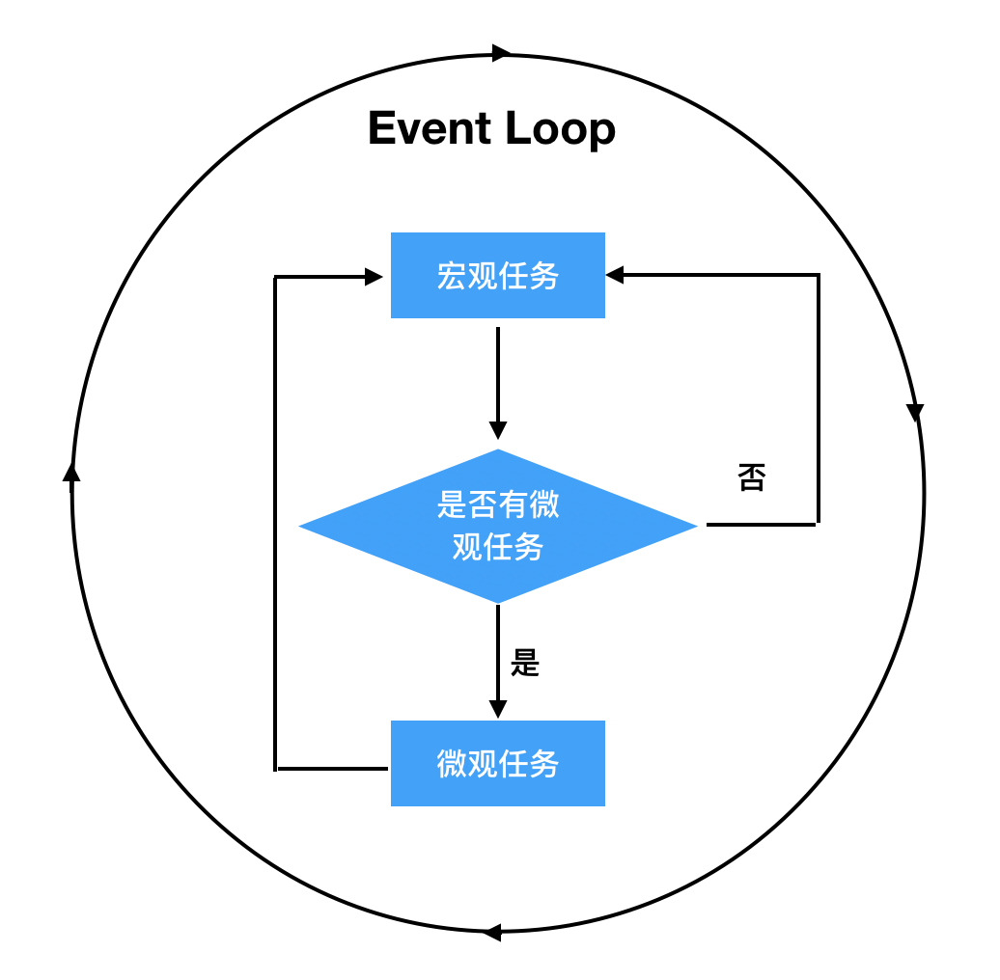

由于JavaScript的用途特性：作为浏览器的一种脚本语言来实现用户交互和操纵DOM节点。为了避免多个线程同时DOM引发的不一致问题，所以JavaScript从设计之初，就是单线程的，这也是JavaScript的一大特点。但是我们都知道JavaScript有很多的异步函数，那么他是靠什么实现这种异步机制的呢？三分天注定，七分靠Event Loop。
<!-- more -->

<style>
img {
  width: 400px;
}
</style>

我想在看到这篇文章之前大家一定都看过阮一峰关于这块内容中的一张图片

虽然是简简单单的一张图但是却包含了很多的信息。我们就从这张图片入手来了解Event Loop。

## 执行栈和事件队列
要了解Event Loop我们需要从两种数据结构开始，执行栈和事件队列。我们都知道栈这种结构的特点是LIFO（后进先出）那么为什么JavaScript使用的是执行栈呢？那岂不是写在前面的代码要后执行吗？相信很多人会感到好奇。

执行栈中保存的不是一条条的执行语句，而是执行上下文，JavaScript会产生三种上下文
- 全局执行上下文 
- 函数执行上下文 
- Eval 函数执行上下文

所以当JavaScript引擎开始执行脚本的时候首先会创建一个全局执行的上下文并压入执行栈，当没遇到一个函数调用的时候就会为这个函数创建一个新的执行上下文并压入执行栈顶，然后执行栈顶上下文中的函数，完成后弹出，以此类推。对于函数执行过程中使用的变量则是保存在一个堆（heap）中，而执行栈中保存的则是一些指针。

事件队列理解起来相对简单一些，DOM事件、ajax、setTimeout等都会产生一个异步任务添加至任务队列，队列的执行顺序是先进先出（FIFO）。

## 微观任务和宏观任务
根据上面的内容我们了解了一个事件循环的大致过程，实际上异步任务之间在执行的先后顺序也是有差异的。异步任务可以分为两类：微观任务（micro task）和宏观任务（macro task）。

从概念上来看由宿主（浏览器）发起的任务为宏观任务，JavaScript引擎发起的任务为微观任务。宏观任务包括：setTimeout、setInterval、setImmediate、I/O、UI rendering。微观任务包括：process.nextTick、Promise、Object.observe(废弃)、MutationObserver

所以当JavaScript主进程执行完成后（执行栈为空），通过Event Loop机制开始执行异步任务时，首先执行微观任务中的所有任务然后执行一个宏观任务，再去执行所有微观任务，不断循环这一过程。


## 举个栗子🌰

下面列一个微观任务和宏观任务的示例来感受下宏观任务和微观任务的区别
``` js
console.log('script start');

setTimeout(function() {
  console.log('setTimeout');
}, 0);

Promise.resolve().then(function() {
  console.log('promise1');
}).then(function() {
  console.log('promise2');
});

console.log('script end');
```
输出的内容为
```js
script start
script end
promise1
promise2
setTimeout
```
这段程序中setTimeout创建了一个宏观任务，Promise的创建了两个微观任务，所以整个的执行顺序为，主进程输出script start和script end，然后去执行所有的微观任务输出promise1，promise2，最后执行宏观任务输出setTimeout。

## 总结

JavaScript通过Event Loop，让这种单线程的语言可以在不阻塞用户体验的情况下，执行异步任务。了解JavaScript的运行机制不仅仅是在面试的时候会用到，当我们遇到一些奇奇怪怪的问题找不到原因的时候可以从底层一点的原理入手，定位分析问题。


