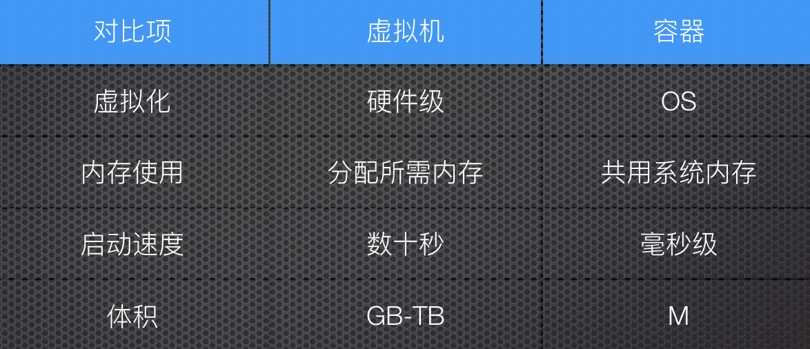
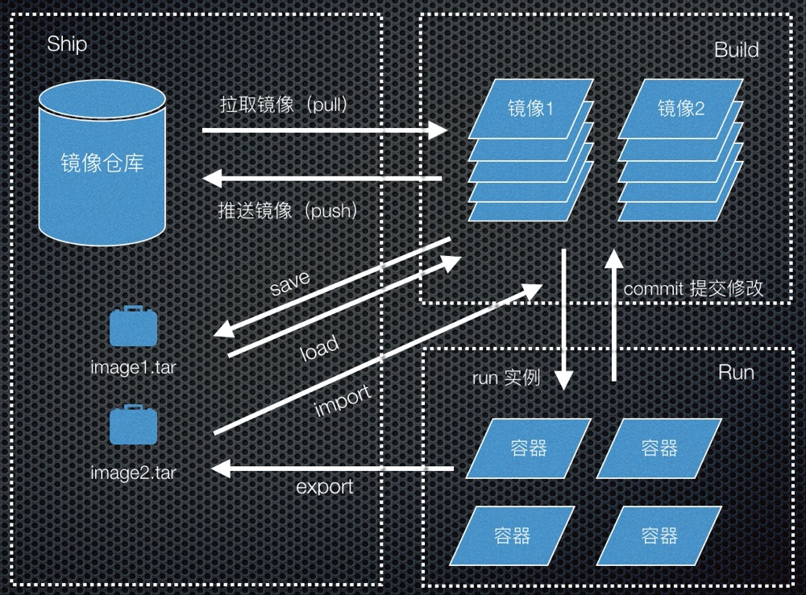

第一次接触Docker这个东西还是在两年前，所在的公司主要是提供SAAS服务的，所以很早就开始使用微服务+容器化的方式进行软件交付。对于一个前端仔来说，是完全陌生的一个东西。由于开发中需要使用Docker来搭建一些本地的开发环境，之后将自己的应用打包成Docker镜像，所以开始接触了Docker，能感受到Docker为整个开发生产流程提供了很大的便利。慢慢的Docker也就成了电脑上必备的一个工具。通过通过Docker也了解到了很多运维相关的技能，技术栈更加全面。

<!-- more -->

## Docker的前世今生
任何一个新技术都不是突然出现，从石头里面蹦出来的，Docker也是站在巨人的肩膀上，优化了容器的体验，让更多的人可以很简单的使用这一技术。巨人就是LXC(linux container)技术，该技术主要包含Namespace实现访问隔离，Cgroup来实现资源控制，Docker在这一技术的基础上提供了更加简便的控制工具，降低了开发这是用容器技术的门槛。

最初缔造Docker的是一个做PAAS平台叫做DotCloud的公司，后来由于Docker太受欢迎，DotCloud公司也改名成了Docker.Inc。目前Docker已经加入了Linux基金会，遵循Apache2.0协议，其代码托管于[Github](https://github.com/moby/moby)。

## Docker与虚拟机
同样都是虚拟化技术的容器技术经常被拿来和虚拟机进行对比：

从虚拟化的方式来看，虚拟机是硬件级别的虚拟化，cpu、内存等都是虚拟化出来的，而容器只是基于相同的运行内核在操作系统层进行虚拟化。所以在内存使用上，容器是需宿主机共用相同的内存的。因为容器只虚拟化了操作系统，所以其启动速度大大优于虚拟机，同时非常的轻量。
因为各自的特点容器和虚拟机也有着不同的应用场景：
- 虚拟机：运行需要消耗虚拟机大部分资源的应用程序
- 容器：轻量级Web服务
但是容器和虚拟机也不是那种非此即彼的关系，很多的应用场景是把虚拟机作为宿主机，然后在里面运行Docker容器。

## 为什么前端er需要了解Docker
前端在大多数人的眼中可能就是写写前端页面，Docker可能更多的是运维或者后端开发才需要接触的东西，那么为什么一个前端工程师也需要学习使用Docker呢？

- 本地运行作为一种工具快速搭建开发环境
- 服务器部署应用，避免生产测试环境不一致导致的问题，更容易做系统迁移
- 作为工程师，需要有综合的能力，多种方式解决问题

## Docker的核心概念
Docker大部分的操作都是围绕着三大核心概念仓库、容器、镜像进行的，了解了这三个概念，才能顺利的了解Docker的工作的整个生命周期。


### 镜像仓库（Repository）
镜像仓库顾名思义就是存放镜像的仓库，对于镜像的Ship起着非常重要的作用，在网络互通的情况下，用户可以将镜像通过docker push命令将本地打包好的镜像存储至镜像仓库，然后在目标的服务器通过docker pull命令拉取下来。目前一个最大的镜像仓库就是Docker Hub。当然也可以自己搭建一个镜像仓库的服务，阿里云上就支持创建一个免费的Docker镜像仓库。

### 镜像（Image）
Docker镜像就相当于我们安装操作系统所使用的的iso文件，可以通过Dockerfile文件通过docker build命令创建，Docker在镜像的存储结构上使用的是分层的存储方式，Dockerfile的每一行指令都会生成一层，使用这种分层的存储方式的好处就是，多个镜像可以共用相同的层，从而达到节省空间的作用。

### 容器（Container）
容器是在镜像的基础上运行起来的可读写的一层（docker run），也是真正工作的部分，如果使用过程中产生了对容器的修改，我们也可以使用docker commit命令将其持久化到镜像中，但是如果镜像用于生产一般都需要从Dockerfile重新去生成这个镜像，因为docker commit会使镜像生成新的一层，同时这种修改是无法被使用者知晓的。

镜像还有另外一种存储方式就是使用tar文件的形式，如果服务器环境离线，就只能将镜像的tar包拷贝至目标服务器，然后在解压出来。生成tar包有两种方式：
- docker save：这种方式将镜像的全部历史和层信息都保存起来，还原回去的镜像信息也是完整的，只是体积较大。
- docker export：将容器这一层保存下来，体积很小，通常用于生成基础镜像。

### Docker网络模式（Network）
Docker容器之间资源都是隔离的，所以Docker网络对于容器之间的通信非常重要,Docker提供如下几种网络模式，针对不同的用户场景进行使用，当然也可以使用开源社区的其他网络插件。
- 【Host模式】：容器不会虚拟出自己的网卡，与宿主机共用相同的ip和端口，这种情况一般在测试开发时使用，生产时一般只将作为api gateway的服务端口进行暴露，这样可以最小化可能性造成的端口冲突。
- 【Bridge模式】：在主机上创建docker0网桥，通过端口映射的方式与宿主机通信，这种网络模式比较常用，也是默认的网络模式，可以自由地将容器内部的端口通过docker0网桥映射到宿主机
- 【Container模式】：容器不会创建自己的网卡，配置自己的IP，而是和一个指定的容器共享IP、端口
- 【None模式】：顾名思义，未设置网络，无法与宿主机进行网络通信，一般用于本地开发临时起一个容器使用

### Docker数据持久化（Volume）
有些容器服务运行的时候会产生一些重要的数据，如数据库、Redis等，如果不保存下来，会就造成核心数据的丢失。当然可以使用commit的方式，但是commit会导致镜像的体积变的很大。所以Docker提供了卷管理的功能。

### 数据卷（Data Volumes）
将容器内的特定目录挂在到宿主机上的目录上
```
// 将容器内的data目录挂载到宿主机/host/data目录
docker run -v /host/data:/data --name test test-image
```
当文件的挂在目录很多的时候很可能会出现误删，或者管理混乱的问题。所以Docker另外一种数据卷容器的方式管理数据。

### 数据卷容器（Data Volumes Container）
用户提前创建一个数据卷容器，多个容器可以共用一个容器数据卷，数据的管理更加方便

docker volume

|命令	|说明|
|----|----|
|create	|创建一个数据卷容器|
|inspect	|查看数据卷详情，目录等|
|ls	|列举所有数据卷容器|
|prune	|清除所有未被使用的数据卷|
|rm	|删除特定数据卷|

## 容器编排工具 — Docker Compose
如果每次都是通过手动的方式启动Docker容器，需要指定很多的参数非常麻烦，并且面对多个容器需要启动时就更复杂了这时就需要我们的Docker三剑客之一的Docker Compose来解决多容器编排的问题。
docker compose让我们通过一个配置文件的方式，管理对应的容器服务。一个简单的配置文件结果如下:
```
version: '3'
services:
  test-service:
    container_name: test-service
    image: test-service-image
    ports:
      - 8080:80
    volumes:
      - /host/data:/data
    networks:
      - test-network
    restart: always
networks:
  test-network:
    driver: bridge
```
这个配置文件就相当于我们执行了：
```
docker network create -d bridge test_network
docker run -it -d --name test-service -p 8080:80 -v /host/data:/data --network test-network test-service-image
```
好奇的人可能会问 Docker Compose是三剑客之一 那其他两剑客都是谁呢？

- docker-machine： 解决docker运行环境问题 （window）
- dcoker-compose：解决本地docker容器编排问题
- docker-swarm： 解决多主机多个容器调度部署（被K8S取代）

## Docker的优缺点
软件开发没有银弹，任何技术也都是具有两面性的。Docker作为日常工作中的辅助工具，可以为我们节省大量的配置环境的时间，但有些时候也会给我们带来额外的麻烦。

### 使用Docker可以带来的好处
Docker的好处还是显而易见的，如：

- 容器内部包含整个的运行环境，可以避免优于开发生产环境不一致导致的问题
- 容器之间相互隔离，避免服务多了之后相互之间的影响
- 容器的tag机制和一次构建多出运行的特性，可以很好的做持续集成，持续发布

### Docker可能引起的问题
- 使用Docker还是有一定的学习成本，维护时有时也需要进入容器内部进行调试，会增加一定的维护成本
- 容器运行时会产生日志文件等数据，或者历史的镜像如果不进行清理的话会占用大量的系统磁盘空间
- Docker服务之间存在隔离，服务之间交互主要通过网络服务名，出现问题不容易定位

## 总结
这篇文章主要较为笼统的介绍一下使用Docker中需要了解的概念和工具，后面再针对一些特定的模块详细写一些文章来介绍。
