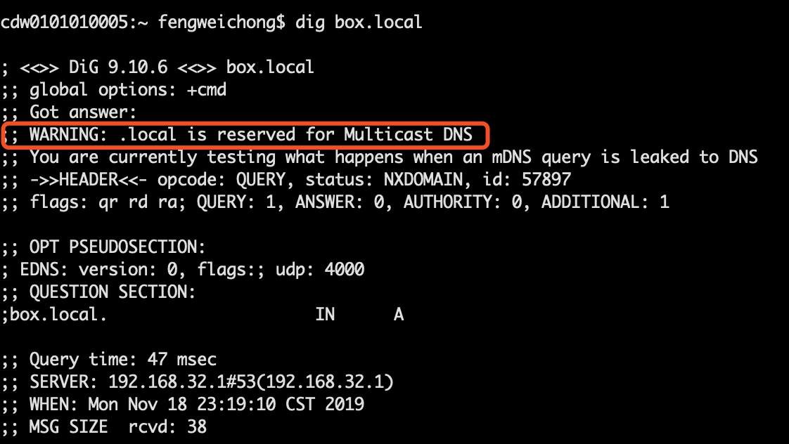

最近被一个问题折腾了好久，现象就是局域网内有一个设备作为一个小型的局域网服务器，通过Mac和较高版本的win10系统都可以通过设备名正常访问到服务器，但是有个同事的装有win10系统的笔记本和一台windows server台式机就是访问不到。为了解决这个问题，对DNS解析的过程进行了一定的了解，这里就总结一下这个问题产生的原因，以及解决的思路
<!-- more -->

## 问题的发现
正常情况下可以通过 http://xxx.local 的地址访问设备名为xxx的设备主页，但是一些电脑却一直无法访问。经过观察发现通过浏览器直接访问或者ping xxx.local的方式都无访问，返回的信息都是域名无法解析。但是通过对应的ip地址可以正常访问，所以初步定为是DNS解析出了问题。

## DNS解析的过程
知道了是DNS的问题所以就去了解了一下DNS解析的过程：
- 检查本地hosts文件中是否有这个域名的映射关系
- 查找本地DNS解析器缓存
- 在本地DNS服务器去查询尝试解析域名
- 到互联网上去从根域名开始，逐层解析域名

详细解析过程可以查看[《DNS解析的过程是什么》](https://www.zhihu.com/question/23042131)
在确认了hosts文件，清除了缓存，检查了本地网络所在的DNS服务器后，结果都没问题。。。

中间通过nslookup以及dig命令尝试对域名进行解析，奇怪的是不仅在问题电脑上找不到域名，可以正常访问的电脑上也无法解析。特别是dig指令中输出了这样一条警告信息

开始猜想难道是因为.local结尾的域名不是通过DNS解析而是mDNS(Multicast DNS)

## 什么是mDNS
mDNS可以理解为局域网内部的 DNS 系统，它和 DNS 有很多相似的地方，通过它可以实现局域网内部的服务发现、查找和广播，同时它是基于组播的协议。

我们的设备上使用的是[avahi-daemon](https://www.cnblogs.com/taosim/articles/2639520.html)将自身的设备和服务注册到mDNS服务。

确认了xxx.local是通过mDNS来解析的那么接下来解决的方向就是为什么在一些windows10的笔记本上无法解析这个域名呢？

## windows10 mDNS支持问题
经过搜索发现windows10 1803以下版本中的mDNS服务存在一定的缺陷，导致无法发现局域网内的设备
原因出处来自于一些日本的网站 可以用chrome翻译过来 大致能理解--
- [《mDNSを使ってローカルDNSサーバーを廃止する》](https://qiita.com/maccadoo/items/48ace84f8aca030a12f1)
- [《Bonjour for Windows不要！Windows10マシンに".local"でアクセスしよう！》](http://moguno.hatenablog.jp/entry/2015/09/12/100231)
- [《既定の受信の規則 “mDNS (UDP 受信)” が機能しない問題》](https://blogs.technet.microsoft.com/jpntsblog/2018/04/28/%E6%97%A2%E5%AE%9A%E3%81%AE%E5%8F%97%E4%BF%A1%E3%81%AE%E8%A6%8F%E5%89%87-mdns-udp-%E5%8F%97%E4%BF%A1-%E3%81%8C%E6%A9%9F%E8%83%BD%E3%81%97%E3%81%AA%E3%81%84%E5%95%8F%E9%A1%8C/)

解决的办法大致都是在windows防火墙中添加一项入站规则，但是很不幸，经过尝试并没有起到效果。不过几经尝试问题产生的原因已经很明确了，相信距离解决也就不远了。

于是继续查找资料，发现有人在windows上面装了Apple的iTunes解决这个问题。

## 问题解决
于是在电脑上下载了iTunes果然可以成功访问了，那么iTunes为什么会有这么神奇的力量呢。原来苹果的软件为了能够让电脑上可以自动连接到处于相同网络的苹果设备，会在安装iTunes时同时安装[Bonjour](https://bonjour.updatestar.com/zh-cn)实现设备间的相互连接。所以卸载了iTunes后为问题电脑装上了Bonjour即可以用最小的代价解决问题。

