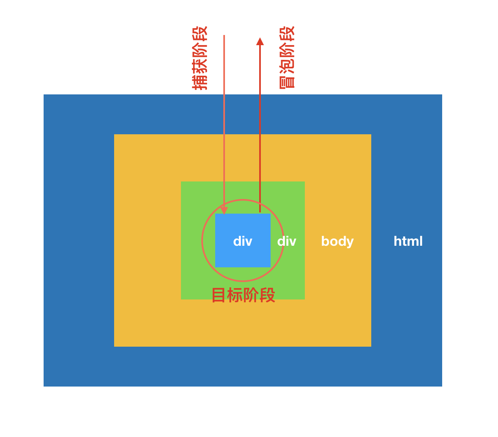

在开发一个“点击按钮弹出popup”功能组件的时候需要点击空白位置自动关闭popup，通常的做法是给body绑定一个click事件，然后去关闭面板。但是会发现给body绑定了事件后，点击按钮后无法打开popup面板，发现原来是打开面板后立刻触发了body的click事件，导致popup面板立刻被关闭了。深入了解了一下DOM的事件流，找到了问题的原因，解决的办法也很简单,阻止事件冒泡。

<!-- more -->

<style>
img {
  width: 400px;
}
</style>

## 事件流的三个阶段：捕获，目标，冒泡

一个DOM事件的执行需要分为三个阶段： 执行的过程如图所示


**1、捕获阶段**
事件从根节点流向目标节点，在经过的各个DOM节点上触发捕获事件，直至到达目标节点。执行顺序为：Window->Document->Html->Body->Target
**2、目标阶段**
事件达到目标节点后，触发执行。如果节点上绑定了多个事件的话，按照事件绑定的先后顺序执行。
**3、冒泡阶段**
如果冒泡没有被禁止的话，事件流将会从目标节点开始再次传播到根节点，执行顺序为：Target->Body->Html->Document->Window

## 通过一个简单的demo可以更好地帮助我们理解这一过程

``` html
<!DOCTYPE html>
<html lang="en">
<head>
    <meta charset="UTF-8">
    <meta name="viewport" content="width=device-width, initial-scale=1.0">
    <meta http-equiv="X-UA-Compatible" content="ie=edge">
    <title>Document</title>
    <style>
        div{
            padding: 20px;
            text-align: center;
            color: #fff;
        }
        #container-3{
            background-color: coral;
        }
        #container-2{
            background-color: cyan;
        }
        #container-1{
            background-color: green;
        }
    </style>
</head>
<body onload="init()">
    <div id="container-3">
            container-3
        <div id="container-2">
            container-2
            <div id="container-1">
                container-1
            </div>
        </div>
    </div>
</body>
</html>
```

``` JavaScript
document.getElementById('container-1').addEventListener('click', function(e){
    console.log('container-1 clicked')
})
document.getElementById('container-1').addEventListener('click', function(e){
    console.log('container-1 capture')
}, true)

document.getElementById('container-2').addEventListener('click', function(e){
    console.log('container-2 clicked')
})
document.getElementById('container-2').addEventListener('click', function(e){
    console.log('container-2 capture')
}, true)
document.getElementById('container-3').addEventListener('click', function(e){
    console.log('container-3 clicked')
})
document.getElementById('container-3').addEventListener('click', function(e){
    console.log('container-3 capture')
}, true)
document.body.addEventListener('click', function(e){
    console.log('body clicked')
})
document.body.addEventListener('click', function(e){
    console.log('body capture')
}, true)
```
运行结果为：


在demo中我们用addEventListener的第二个参数 为每个DOM节点绑定了两个事件，默认/false：事件在捕获阶段触发， true: 事件在冒泡阶段触发。从输出的结果可以看出整个事件流的执行顺序。
其中有一个地方在container-3上面同时绑定了捕获事件和冒泡事件，没有先触发事件捕获。是因为事件流已经传播到了节点的目标阶段，所以是按照事件绑定的顺序进行执行的。

## 阻止事件冒泡

当子节点和父节点同时绑定了点击事件时，如果只想在子节点触发事件，不需要父节点事件执行就需要在子节点阻止事件冒泡
阻止事件冒泡的方法就是在事件函数里面执行
``` JavaScript
e.stopPropagation()
```
不明白为什么有些人在博客里面特别写了stopPropagation只能阻止事件冒泡不能阻止事件捕获。但是经过实际的测试stopPropagation也是可以在事件捕获阶段阻止事件流的
同样DOM3级新增事件stopImmediatePropagation()也可以用来阻止事件流的传播。

那么这两个方法有什么区别呢？
**stopPropagation只会阻止事件冒泡和捕获，但是stopImmediatePropagation会阻止后面元素绑定的其他事件。**

## 事件冒泡应用——事件代理

事件代理也叫事件委托，就是利用事件流的冒泡阶段，给父节点绑定事件来处理子节点事件的过程。

如果列表中存在大量的列表项，为每一项都绑定一个事件就会占用很多的运行内存造成资源的浪费。所以可以利用事件流的冒泡原理只为他们的父节点绑定一个事件然后通过事件对象中的event.target中属性的差异来区分子节点。


