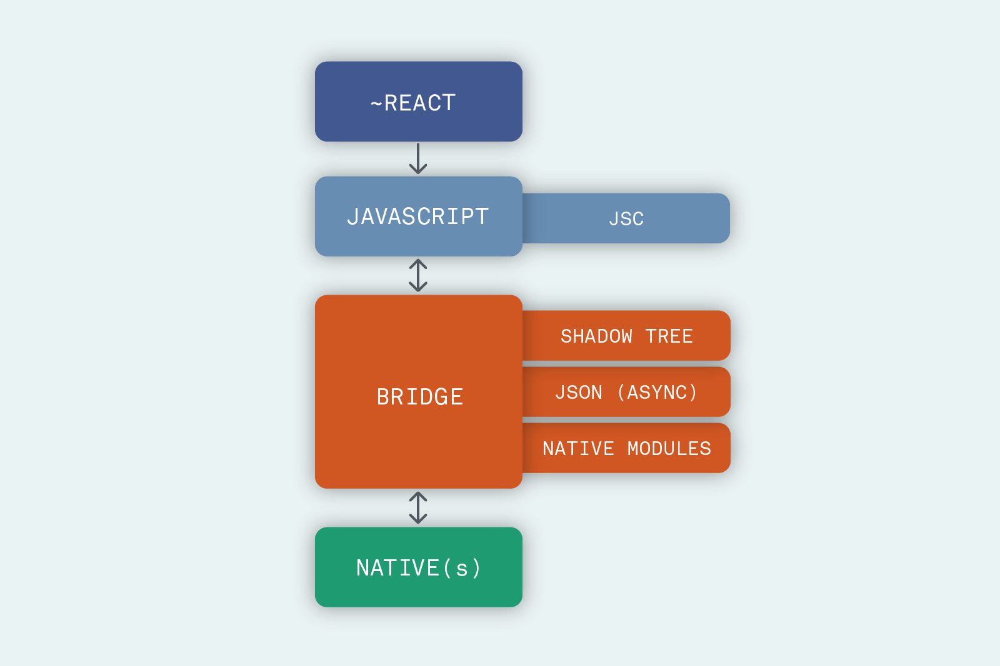
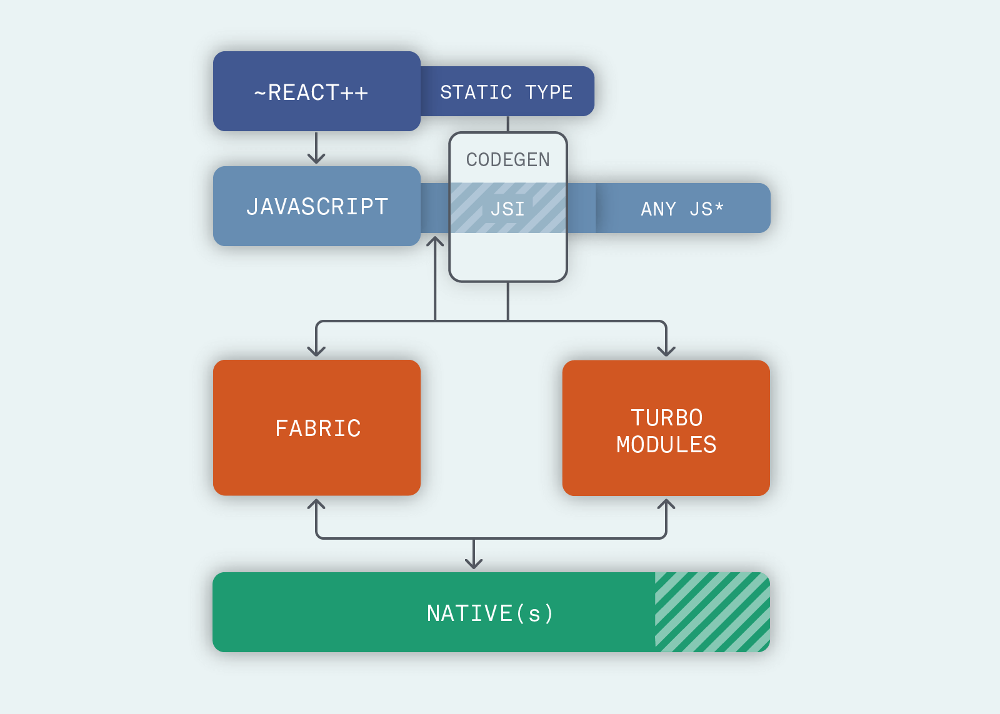

React Native的主要作用是让开发者可以使用前端React的开发框架来开发可以在多个平台运行的应用。仅仅了解前端开发可以让我们快速搭建一款简单的App，但是深入了解了React Native的底层原理，可以帮助我们更好的定位开发中遇到的问题，和从多端的角度出发解决问题。

<!-- more -->

## React在浏览器运行原理

在了解React Native的原理之前我们先简单回顾一下React和浏览器的工作原理:
首先Babel将React JSX语法糖编译成React.createElement表达式即虚拟DOM节点，然后利用虚拟DOM的Diff算法，对比出需要渲染的元素交由浏览器的渲染引擎渲染，从而形成丰富的浏览器页面。那么React Native是如何将React代码展示在不同平台上呢？

## 基于Bridge的架构原理
在0.59版本之前React Native使用的基于Bridge的架构方式

1. 在开发阶段仍然是聚焦于React Components的开发，Babel会将代码编译成浏览器可识别的表达式，并打包成jsbundle文件存储于App设备本地或者存储于服务器（热更新机制）
2. 打开App后，加载并解析jsbundle文件，在JavascriptCore中进行运行，这个地方Android和IOS的差异就是IOS原生就带有一个JavascriptCore而Android中需要重新加载，所以这也造成了Android的初始化过程会比IOS慢一些。
3. 运行时需要将前端的组件渲染成Native端的视图，首先如同React中的虚拟DOM一样，在Bridge中也会构造出一个Shadow Tree，然后通过Yoga布局引擎将Flex布局转换为Native的布局，最终交由UIManager在Native端完成组件的渲染。
Bridge架构对于开发者来说很好的屏蔽了各个平台之间的差异，相对于WebView也能够提供不错的近原生操作体验。但是Javascript与Native之间的通信过度的依赖Bridge，当交互频繁或数据量很大的时候可能造成白屏或事件阻塞。而且JSON的序列化操作的效率也比较低。在Flutter的压力下，不改变意味着用户的流失，那么重构后的React Native是怎么优化的呢？

## 基于JSI的新架构原理

首先解释下新架构下的几个新概念
- JSI（Javascript Interface）：JSI的作用就是让Javascript可以持有C++对象的引用，并调用其方法，同时Native端（Android、IOS）均支持对于C++的支持。从而避免了使用Bridge对JSON的序列化与反序列化，实现了Javascript与Native端直接的通信。
JSI还屏蔽了不同浏览器引擎之间的差异，允许前端使用不同的浏览器引擎，因此Facebook针对Android 需要加载JavascriptCore的问题，研发了一个更适合Android的开源浏览器引擎Hermes。

- CodeGen：作为一个工具来自动化的实现Javascript和Native端的兼容性，它可以让开发者创建JS的静态类，以便Native端（Fabric和Turbo Modules）可以识别它们，并且避免每次都校验数据，将会带来更好的性能，并且减少传输数据出错的可能性。

- Fabric：相当于之前的UIManager的作用，不同之处在于旧架构下Native端的渲染需要完成一系列的”跨桥“操作，即React -> Native -> Shadow Tree -> Native UI，新的架构下UIManager可以通过C++直接创建Shadow Tree大大提高了用户界面体验的速度。

- TurboModules：旧架构下由于端与端之间的隔阂，运行时即便没有使用的模块也会被加载初始化，TurboModules允许Javascript代码仅在需要的时候才去加载对应的Native模块并保留对其直接的引用缩短了应用程序的启动时间。

总结一下，旧架构中Bridge为React Native JS与Native交互的性能瓶颈，那么新架构的核心改变就是避免了通过Bridge将数据从JavaScript序列化到Native。

## 总结
文章的内容参考了国内外一些大佬的文章，初学者理解起来可能有一些难度，如果觉得不是很好理解可以试着先跳过，待通过React Native实战之后回过来在来看这部分内容，或许能让你有更深刻的感悟。

## 参考资料
- [React Native EU 2019: Emily Janzer - The New React Native](https://www.youtube.com/watch?v=52El0EUI6D0)
- [Part One: React and Codegen](https://formidable.com/blog/2019/react-codegen-part-1/)
- [Part Two: JSI and JSC](https://formidable.com/blog/2019/jsi-jsc-part-2/)
- [Part Three: Fabric and TurboModules](https://formidable.com/blog/2019/fabric-turbomodules-part-3/)
- [Part Four: The New React Native Architecture Explained](https://formidable.com/blog/2019/lean-core-part-4/)
- [React Native架构演进](http://www.ayqy.net/blog/react-native-new-architecture/)