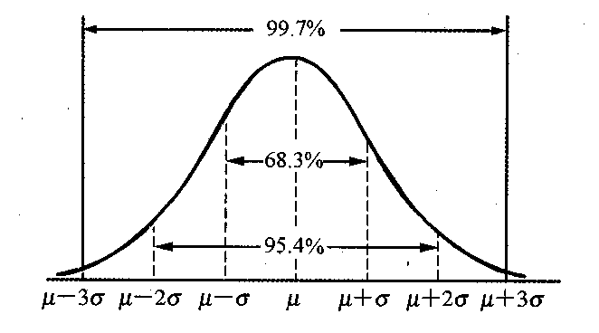

开发人员在进行开发工作之前都需要给出一个工作量的评估，以便后续的工作任务可以基于该时间进行排期。大多数开发人员评估工作量主要是基于过往的工作经验拍脑袋决定，并会给自己预留出一定的Buffer时间。这样可能的问题就是过度依赖个人的开发经验，且Buffer时间的没办法量化。我们需要一种科学的工作量评估方法——三点估算。

<!-- more -->

## 详解三点估算
### 什么是三点估算
先来介绍一下什么是三点估算法：
三点法评估需要将一个任务的时间评估分成：最乐观时间、最可能时间、最悲观时间。好比上班路上花费的时间，一般最可能花费时间是30min；乐观情况不堵车都是绿灯只需要20min，如果悲观考虑到可能赶上上班高峰，路上很堵则需要50min才能到公司。
将工作量模拟成正态分布的形式。那么就可以得到如下的公式：
```
期望值μ = (最乐观时间 + 4 x 最可能时间 + 最悲观时间) ➗ 6
标准差σ= (最悲观时间 - 最乐观时间) ➗ 6
```

通过计算得到的期望值μ是一个预期工作的持续时间，标准差σ代表由于开发过程中的不确定因素导致实际工期和期望工期的浮动时间。

### Buffer时间的设定
我们先来回答一个问题：我们在计算得到的【期望值μ】之前完成开发工作的任务的概率是多少——没错，不论开发经验是否丰富都只有50%！
明显如果你给出一个工作量评估并跟PM说我只有50%的可能性完成，他可能会告诉你，我也有50%的可能性不给你发项目奖金。
学过概率论正态分布我们会知道点落在各个区间的概率存在如下规律：

|标准差区间	|区间概率	|完成概率|
|----------|-------|-------|
|1倍标准差	|68.3	|84.15|
|2倍标准差	|95.4	|97.7|
|3倍标准差	|99.7	|99.85|

因此我们我们可以通过在计算得到的期望值的基础上适当增加标准差时间作为Buffer，来保证我们的工作可以按时交付。

### 关于三点估算的思考
- 工作评估粒度问题
在评估前我们都需要对当前任务进行拆分，使用三点估算我们不需要粒度拆分的很小，因为最初没办法面面俱到考虑到所有功能点，粒度维持在一个中小型独立的功能模块为宜。
- 标准差的理解
数学上标准差代表着数据的稳定性，标准差越大数据波动越大，在三点估算中标准差也反映着开发者的对于当前工作熟练程度，因此，越是经验丰富在熟悉的领域最终的标准差就会越小，陌生的领域也会计算得到较大的Buffer时间，保证可以如期交付。

### 为什么使用三点评估
三点评估在评估过程中考虑到了项目中不确定性的风险，且有概率统计的依据，保证了评估的准确性，同时该方法计算简单、容易理解在实际开发工作中的使用门槛还是较低的。

## 其他评估方法
除了三点评估，下面的一些方法也常常用来进行工作量的评估：

|方法	|描述	|评价|
| ----- | ---- | --- |
|类比法	|和过往类似项目进行类比估算	|不同项目之间往往存在较大差异，存在较大风险|
|专家推断	|行业内经验较丰富人员的给出指导性意见	|过度依赖个人经验，不具备普适性|
|参数估算	|根据任务进行中特定材料的耗费情况进行估算	|不适用于软件开发|
|自下而上估算	|将任务拆分成一个一个细致的工作包，并单独评估，最终汇总|	最准确，但是评估成本较高，在开发中适用于小型简单的任务|

## 总结
不要轻视启动阶段的计划评估工作，这一过程也是对需求深入理解的过程，从而规避复工、回炉重造的风险。一个好的工作量评估，需要建立在对当前的需求足够了解，可以识别潜在风险的基础上。评估中往往允许我们合理加入一定的Buffer时间，因为一旦延期，你可能影响到的是后续他人的工作计划，从而影响整体的交付时间。管理规范的团队延期后往往会组织复盘会，所花费的代价远不止少评估了工作量这么简单。当然也为了避免延期预留过多的Buffer时间，造成人力资源的浪费。最后分享帕金森定律中最常被引用的一句话：
> Work expands to fill the time available for its completion.
你可以用来完成工作的时间有多少，你的工作就会拖延、膨胀、复杂到让你足以填满那段时间为止。

希望使用三点评估法可以帮助你合理科学的评估开发工作量。