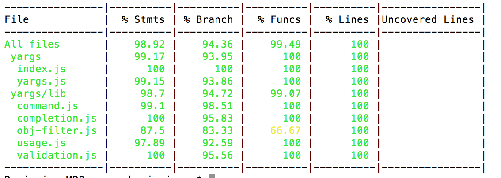

最近在做一些代码重构的工作，为了保证代码的质量，特意花了些时间把重构的代码添加了单元测试。这里就跟大家分享下，这段时间写单元测试的一些收获和感受。
<!-- more -->

## 对于单元测试的理解
个人对于单元测试的定义是：程序自身开发者对于程序最小独立单元，通过程序模拟各种异常和边界条件，自动检测代码的执行结果是否符合预期。以保证程序质量，较少后期维护测试成本的一个过程。
所以单元测试具有以下的特征：
1. 单元测试是程序员自己写的😁，不应该逃避的。
2. 为了保证测试单元的独立性，要尽可能保证代码高内聚、低耦合。
3. 单元测试不能只测试正确的结果，要通过测试用例让程序报错。
4. 测试的过程不能有人工去参与，输入和输出不能手动去进行。
5. 写单元测试可能会花费很多时间，但是从长远来看利大于弊。

## 单元测试实践
在一个系统的开发中，后端接口的设计和稳定性极为重要，因为后端的接口一旦出现问题，将可能会影响到多个前端模块。同时因为每个接口的逻辑的单一性，后端接口也是比较容易进行单元测试的，服务的状态、参数的合法性、返回的数据格式、核心业务逻辑、数据库异常报错时的特殊处理都是单元测试应该覆盖到的点。

这里的一个单元测试实践的整体方案是：基于Koa2的Nodejs服务端代码，采用Mocha单元测试框架，使用Chai来进行断言验证、Sinon来Mock数据库等依赖环境，最后使用Istanbul来计算单元测试的覆盖度。

- **Mocha**
Mocha是一个具有丰富特性的JavaScript框架，使用起来非常简单。
- **Chai**
Chai是一个使用最多的nodejs断言库，支持Should、Expect这种BDD风格的单元测试，也支持Assert这种TDD的单元测试风格，使用者可以根据自己的偏好进行选择。
- **Sinon**
单元测试时屏蔽掉测试单元中对于外部环境的依赖，Sinon就是解决这个问题，Sinon可以使用spy、stub、mock等方法监听或模拟替代接口返回结果。并且Sinon可以很好地与各种单元测试框架进行集成。
- **Istanbul**
Istanbul是一个单元测试覆盖度的计算工具，分别统计的是语句覆盖度、分支覆盖度、函数覆盖度和文件行数覆盖度、并且可以看到哪些行单元测试没有覆盖。

不过Istanbul仅支持ES5和ES2015+的JavaScript代码、所以对于使用了ES6的代码则需要使用[Istanbul/nyc](https://github.com/istanbuljs/nyc)

## 怎么最大化的发挥单元测试作用
大家都知道单元测试的重要性，但是怎么来写单元测试才能更好地发挥出单元测试的价值呢？在这里通过几个问题来聊一聊这个话题：

- **单元测试的覆盖率是越高越好吗？**

如果单纯考虑覆盖度这一个因素的话，那单元测试的覆盖度当然是越高越好。但是也不能一味的追求单元测试的覆盖度，在有些项目中，开发人员可能会说我们的代码单元测试覆盖度为100%，但是那又能说明什么问题，即使单元测试覆盖度完全覆盖，也不能保证写出来的代码质量很高同时完全没有bug。单元测试只是一个帮助你提升代码质量的一个辅助手段，并不是一个银弹。业界标准通常在 80% 左右。过分的准求单元测试的覆盖度，可能在单元测试上付出很大的代价和成本。

- **该在什么时候写单元测试？**

写代码，一时爽，一直写，一直爽。但是等到领导告诉你代码写单元测试的时候，就非常不爽了，因为一下子面对那么多的单元测试，谁面对都会很头疼。等功能都开发完成了再去补充单元测试，这样的单元测试起不到太多的作用。首先是心态上肯定有抵触心理，把单元测试当成一项煎熬的任务，这样的单元测试质量也不会很高。那么应该在什么时候写单元测试呢？—— 与开发同时进行，开发之前写单元测试叫测试驱动开发（TDD），但是这种方式韩式有一定事件难度的。所以比较可行的是一边开发一边写单元测试，通过单元测试来测试程序。这样的好处是你会随时之一代码结构的合理性，因为只有程序代码单元，高内聚、低耦合你在写单元测试的时候就会非常舒服。

- **测试用例该怎么写？**

首先在写单元测试的顺序上，通常使用的是一种自底向上的策略，就是先对底层的单元进行单元测试，然后逐层向上，直至完成了所有的单元测试。这种方法可以节省桩单元（Stub）的开发，提升测试效率。
然后单元测试也不能只去跑那些正确的逻辑，也要用一些测试用例覆盖那些对于错误和异常的处理，对于一些循环的边界条件也要覆盖。

## 感受和总结
“单元测试永远无法证明代码的正确性!!”
“一个跑失败的测试可能表明代码有错误, 但一个跑成功的测试什么也证明不了.”
你可能没有办法一下子爱上单元测试，但是时间会证明单元测试的价值。

## 参考资料
[1] [Geotechnical 单元测试指南 - 中文版](https://github.com/yangyubo/zh-unit-testing-guidelines#id6)

