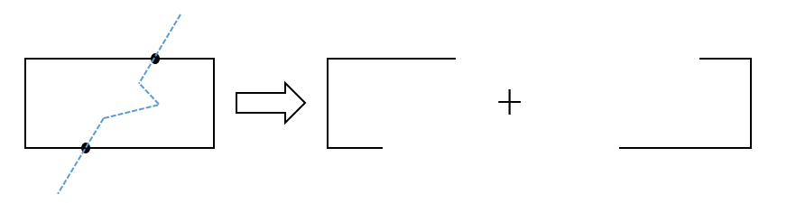
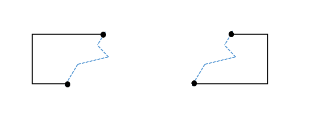
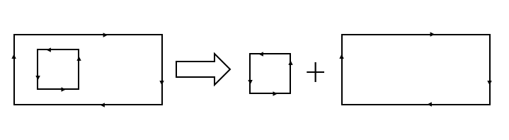
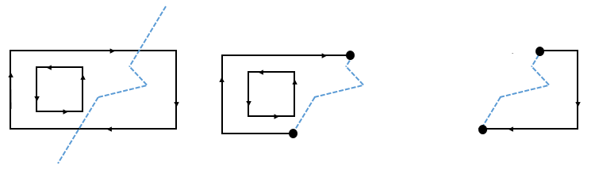
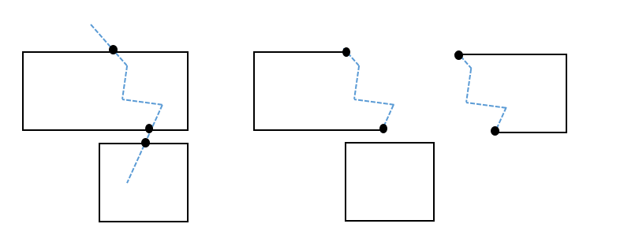

在gis系统中 经常会用到一些裁剪的方法，首先推荐一个非常好用的空间分析JavaScript库--Turf.js，不仅功能强大、使用简单，同时处理速度也很快。

<!-- more -->

Turf.js中提供了一中多边形的裁剪方法是使用多边形去裁剪多边形，但是如果实际工作中需要使用到线去裁剪多边形却无法满足。
http://turfjs.org/docs#bboxClip
这边文章使用turf.js的基本方法，在此基础上构建了线裁剪多边形的方法。
点击可查看[在线demo](http://fengwc.cn/clip-polygon/)

## 算法原理
### 单个polygon的裁剪
> 相交要求：线与多边形有且只有两个交点，且可以将多边形分成两部分

1. 计算多边形与线的两个交点并根据交点将多边形分割成两条线

2. 将分割的两条线根据切割点与切割线进行拼接，分别组成两个多边形，（需要注意的是线的方向性问题）

### 环多边形的裁剪
>相交要求：线与多边形有且只有两个交点，且可以将多边形分成两部分，同时切割线不可与内环相交
注：在geojson数据中外部多边形的顺序为顺时针，环内部多边形顺序为逆时针

1. 将环多边形拆分成内环和外环

2. 对外环多边形通过切割线进行裁剪 方法同（一）

3. 组合切割后的外环多边形和内环多边形：
通过判断内环多边形在那一个切割多边形内部从而判断如何进行组合还原

### MultiPolygon多边形的裁剪
>相交要求：切割线只能与MultiPolygon中的一个Polygon有两个交点

1. 拆分MultiPolygon分割为多个Polygon

2. 根据切割线与多边形的相交情况，对有两个交点的多边形进行进行切割

3. 将分割后的多边形与不参与切割的多边形合并组成要素集进行返回即可

## 项目地址
[Github](https://github.com/FWC1994/clip-polygon)