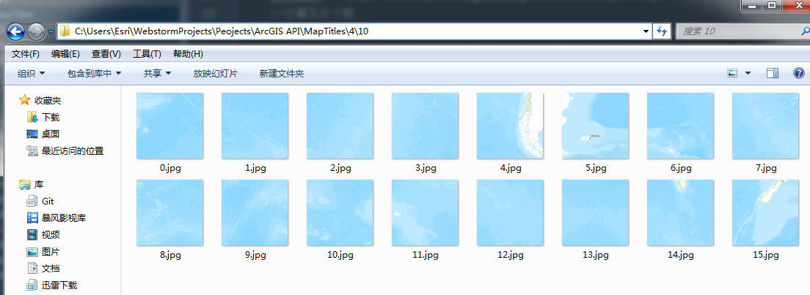
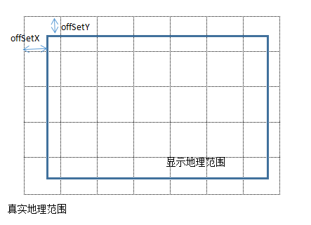

目前，有很多WebGIS开发包，ArcGIS API for JS、OpenLayers、LeafLetjs等为我们从事WebGIS开发的人封装了很多强大的功能。我们很方便的使用这些库的时候，也让我们忽略了很多原理性的东西。

<!-- more -->

比如说，我之前一直在被一个问题困扰，就是如何将一个点正确的显示在浏览器屏幕的正确的位置，即经纬度坐标和屏幕坐标的转换问题。直到我看到一位大牛的[博客](https://www.cnblogs.com/naaoveGIS/category/600559.html)，里面对WebGIS的原理进行了深入的讲解。看了他的文章后一直觉得，我写这篇文章是多余的。但是大神的文章里面并没有详细讲解原理的代码实现。个人觉得还是很有必要通过实现相应功能的方式了解其原理，而且实现时还是遇到了不少的问题，所以还是写了这篇文章。

## 在线地图及参数
以[Arcgis online](http://cache1.arcgisonline.cn/ArcGIS/rest/services/ChinaOnlineCommunity/MapServer)上的瓦片地图为例，服务中有几个比较关键的使用到的参数。

- Height、Weight：每个瓦片的宽度和高度
- Resolution：每一个缩放级别下1像素代表的地图单位（投影坐标）
- Initial Extent：瓦片地图的范围

## 获取地图瓦片
通过观察arcgis地图的瓦片组织方式
```
http://cache1.arcgisonline.cn/ArcGIS/rest/services/ChinaOnlineCommunityOnlyENG/MapServer/tile/缩放等级/行号/列号
```
通过python程序将一定缩放等级的瓦片保存到本地 我只抓取了0-5级别的瓦片，并按照arcgis瓦片的保存方式存储。


```
# -*- coding:utf-8 -*-
import urllib2
import urllib
import os
import math
def GetPage(geturl):
    req = urllib2.Request(geturl)
    user_agent = 'Mozilla/5.0 (Windows NT 6.1; WOW64) AppleWebKit/537.36 ' \
                 '(KHTML, like Gecko) Chrome/52.0.2743.116 Safari/537.36'
    req.add_header('User-Agent', user_agent)
    response = urllib2.urlopen(req, timeout=10)
    page = response.read()
    return page
for level in range(0,6):
    try:
        newdir = "MapTitles/"+str(level)
        os.makedirs(newdir.decode("utf-8"))
    except:
        pass
    for row in range(0,int(math.pow(2,level))):
        try:
            newdir = "MapTitles/"+str(level)+"/"+str(row)
            os.makedirs(newdir.decode("utf-8"))
        except:
            pass
        for col in range(0,int(math.pow(2,level))):
            f = open("MapTitles/"+str(level)+"/"+str(row)+"/"+str(col)+'.jpg', 'wb')
            dataurl = "http://cache1.arcgisonline.cn/ArcGIS/rest/services/ChinaOnlineCommunityOnlyENG/MapServer/tile/"+str(level)+"/"+str(row)+"/"+str(col)
            data = GetPage(dataurl)
            f.write(data)
            f.close()
            pass
        pass
    pass
```

## 展示页面
展会页面只含有一个canvas元素作为地图容器。
```
<!DOCTYPE html>
<html lang="en">
<head>
    <meta charset="UTF-8">
    <title>显示瓦片地图</title>
</head>
<body>
<canvas width="1000px" height="700px" id="mapcv" style="margin: 10px"></canvas>
</body>
<script src="Libs/jquery-1.9.1.min.js"></script>
<script src="Scripts/config.js"></script>
<script src="Scripts/init.js"></script>
</html>
```
## 配置信息
在config.js里面保存了相关的配置信息
```
var MapConfig={
    RootDir:'MapTitles/',
    ViewHeight:700,
    ViewWidth:1000,
    TitlePix:256,
    Resolution:[156543.033928,78271.5169639999,39135.7584820001,19567.8792409999,
                9783.93962049996,4891.96981024998,2445.98490512499,1222.99245256249,
                611.49622628138,305.748113140558,152.874056570411,76.4370282850732,
                38.2185141425366,19.1092570712683,9.55462853563415,4.77731426794937,
                2.38865713397468,1.19432856685505],
    Scale:[ 591657527.591555,295828763.795777,147914381.897889,73957190.948944,
            36978595.474472,18489297.737236,9244648.868618,4622324.434309,2311162.217155,
            1155581.108577,577790.554289,288895.277144,144447.638572,72223.819286,
            36111.909643,18055.954822,9027.977411,4513.988705],
    FullExtent:{
        xmin : -20037507.0672,
        ymin : -20036018.7354,
        xmax : 20037507.0672,
        ymax : 20102482.4102,
        spatialReference : {
            wkid : 102100
        }
    }
};
```

## 功能实现 init.js

上面只是把代码列了出来，这一部分才是我要讲的终点（才到重点☺）

1. 确定战士的地图中心点坐标，以及缩放级别
2. 计算当前窗口显示的地图范围
我们可以根据窗口的中心点坐标，窗口大小，以及当前缩放级别的Resolution可以很容易通过计算得到，当前窗口你可以看到的地图范围。
```
//当前窗口显示的范围
minX=centerGeoPoint.x-(MapConfig.Resolution[level]*MapConfig.ViewWidth/2);
maxX=centerGeoPoint.x+(MapConfig.Resolution[level]*MapConfig.ViewWidth/2);
minY=centerGeoPoint.y-(MapConfig.Resolution[level]*MapConfig.ViewHeight/2);
maxY=centerGeoPoint.y+(MapConfig.Resolution[level]*MapConfig.ViewHeight/2);
```
此处要注意一下地图的行列号的起点在左上角，但是地图左上角的投影坐标x是最小的，y是最大的。也就会说行列号的起点在左上角，投影坐标的起点在左下角。

3. 计算左上角起始行列号
```
//左上角开始的行列号
leftTopTitleRow = Math.floor(Math.abs(maxY-MapConfig.FullExtent.ymax)/MapConfig.Resolution[level]/MapConfig.TitlePix);
leftTopTitleCol = Math.floor(Math.abs(minX-MapConfig.FullExtent.xmin)/MapConfig.Resolution[level]/MapConfig.TitlePix);
```

4. 计算实际地理范围
```
//实际地理范围
realMinX = MapConfig.FullExtent.xmin+leftTopTitleCol*MapConfig.TitlePix*MapConfig.Resolution[level];
realMaxY = MapConfig.FullExtent.ymax-leftTopTitleRow*MapConfig.TitlePix*MapConfig.Resolution[level];
```
我们都知道，我们获取到的瓦片的范围一定是大于显示窗口的范围。否则在窗口内显示的地图是不完整的


5. 计算左上角偏移像素
在将地图瓦片拼接到窗口内是需要考虑到实际地理范围与显示地理范围的偏移
```
//计算左上角偏移像素
offSetX = (realMinX-minX)/MapConfig.Resolution[level];
offSetY = (maxY-realMaxY)/MapConfig.Resolution[level];
```

6. 计算瓦片个数
获得瓦片个数后就可以根据瓦片个数以及偏移后的起始瓦片位置，将每一个瓦片拼接到canvas相应的位置上
```
//计算瓦片个数
xClipNum = Math.ceil((MapConfig.ViewHeight+Math.abs(offSetY))/MapConfig.TitlePix);
yClipNum = Math.ceil((MapConfig.ViewWidth+Math.abs(offSetX))/MapConfig.TitlePix);
```

7. 前端绘制瓦片
```
var mapcv = document.getElementById("mapcv");
var myctx = mapcv.getContext("2d");
for(var i=0;i<xClipNum;i++){
    for(var j=0;j<yClipNum;j++){
        var beauty = new Image();
        beauty.src = MapConfig.RootDir+level+"/"+(leftTopTitleRow+i)+"/"+(leftTopTitleCol+j)+".jpg";
        var TitleImg={
            img:null,
            x:0,
            y:0
        };
        TitleImg.img=beauty;
        TitleImg.x=offSetX+(j*MapConfig.TitlePix);
        TitleImg.y=offSetY+(i*MapConfig.TitlePix);
        TitlesArry.push(TitleImg);
        myctx.drawImage(TitleImg.img, TitleImg.x, TitleImg.y);
    }
}

```

## 总结
希望对WebGIS的初学者理解瓦片地图显示原理能有帮助